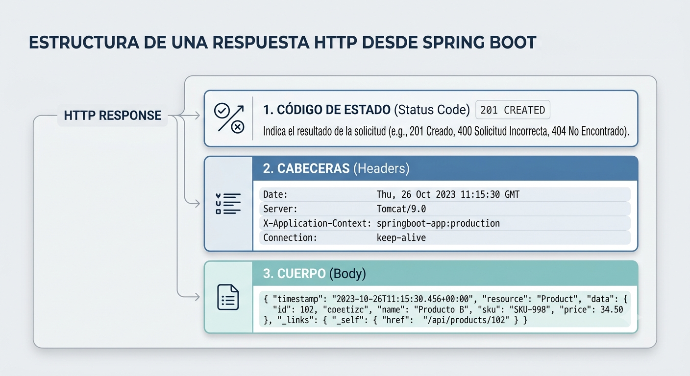

# ResponseEntity

## ¿Cuál es el problema?

Hasta ahora, nuestros controladores hacen algo parecido a esto:

```java
@GetMapping("/{id}")
public Student getById(@PathVariable Long id){
    return studentService.findById(id);
}
```

Hasta este punto sabemos que el método devuelve un objeto `Student`.

Ahora surge una pregunta importante:

> **¿Qué ocurre si el estudiante no existe?**

Podríamos pensar algo como:

```java
return null;
```

o incluso:

```java
throw new RuntimeException();
```

Aquí aparece el primer problema.

Una API **no solamente devuelve datos**.

También debe informar **qué ocurrió con la petición**.

Por ejemplo:

- La operación fue exitosa.
- El recurso solicitado no existe.
- Los datos enviados son inválidos.
- Ocurrió un error interno del servidor.

Toda esa información se comunica mediante los **códigos de estado HTTP**.

---

# Introducción a los códigos HTTP

No es necesario aprender todos los códigos HTTP desde el inicio.

Por ahora basta con conocer los más utilizados.

| Código                        | Significado                          |
| ----------------------------- | ------------------------------------ |
| **200 OK**                    | La petición fue exitosa.             |
| **201 Created**               | El recurso fue creado correctamente. |
| **400 Bad Request**           | El cliente envió datos inválidos.    |
| **404 Not Found**             | El recurso solicitado no existe.     |
| **500 Internal Server Error** | Ocurrió un error en el servidor.     |

> **Importante**
>
> Cuando un controlador devuelve únicamente un objeto, normalmente no estamos controlando explícitamente el código HTTP que recibirá el cliente.
> Recordemos que una respuesta HTTP está compuesta por tres partes:  
> Hay un **código de estado**, unas **cabeceras** y un **cuerpo**.

---

# ¿Qué es ResponseEntity?

`ResponseEntity` es una clase de Spring que representa **toda la respuesta HTTP**, no únicamente el objeto que queremos devolver.

Una respuesta HTTP puede contener:

- Código de estado (Status)
- Cabeceras (Headers)
- Cuerpo de la respuesta (Body)
  [](assets/1-response.png)

En otras palabras:

Antes:

```text
Cliente -> Controller -> Student
```

Ahora:

```text
Cliente -> Controller -> ResponseEntity [-- Status -- Headers -- Body]
```

---

# Ejemplo 1

## Sin ResponseEntity

```java
@GetMapping("/{id}")
public Student getById(@PathVariable Long id){

    return service.findById(id);

}
```

Si no ocurre ninguna excepción, Spring responderá automáticamente con:

```text
200 OK
```

---

## Con ResponseEntity

```java
@GetMapping("/{id}")
public ResponseEntity<Student> getById(@PathVariable Long id){

    Student student = service.findById(id);

    return ResponseEntity.ok(student);

}
```

Aquí aparece por primera vez:

```java
ResponseEntity.ok(student)
```

Este método indica explícitamente que la respuesta tendrá el código HTTP:

```text
200 OK
```

---

# ¿Por qué usar ResponseEntity?

## Sin ResponseEntity

El controlador únicamente puede devolver un objeto:

```text
Student
```

---

## Con ResponseEntity

El controlador puede responder de diferentes maneras dependiendo de la situación.

Por ejemplo:

```text
200 OK
Student
```

o

```text
404 Not Found
```

o

```text
400 Bad Request
```

o

```text
201 Created
```

Todo esto desde un mismo controlador.

---

# Ejemplo completo

## Repositorio simulado

```java
private List<Student> students = List.of(
    new Student(1L, "Ana"),
    new Student(2L, "Carlos")
);
```

---

## Service

```java
public Student findById(Long id){

    return students.stream()
            .filter(student -> student.id().equals(id))
            .findFirst()
            .orElse(null);

}
```

---

## Controller

```java
@GetMapping("/{id}")
public ResponseEntity<Student> getById(@PathVariable Long id){

    Student student = service.findById(id);

    if(student == null){
        return ResponseEntity.notFound().build();
    }

    return ResponseEntity.ok(student);

}
```

---

# ¿Qué está ocurriendo aquí?

Por primera vez el controlador **toma decisiones sobre la respuesta HTTP**.

Si encuentra el estudiante:

```text
200 OK
```

y devuelve el objeto.

Si no lo encuentra:

```text
404 Not Found
```

sin necesidad de lanzar una excepción ni devolver `null`.

Este es uno de los principales beneficios de utilizar `ResponseEntity`: permite construir respuestas HTTP mucho más claras, controladas y profesionales.

### Ejemplo de uso

GET

```text
/students/1
```

Respuesta

```text
200 OK
```

```json
{
  "id": 1,
  "name": "Ana"
}
```

GET

```text
/students/100
```

Respuesta

```text
404 Not Found
```

Sin cuerpo.

### Otros métodos

```java
ResponseEntity.ok()
```

200

---

```java
ResponseEntity.status(HttpStatus.CREATED)
```
HttpStatus.CREATED es un enum que representa el código. Se usa para indicar que un recurso fue creado correctamente.

201

---

```java
ResponseEntity.notFound().build()
```
.notFound() significa que el recurso no fue encontrado.
.build() significa que no hay cuerpo en la respuesta.

404

---

```java
ResponseEntity.badRequest().build()
```
.badRequest() significa que la solicitud es inválida.
.build() significa que no hay cuerpo en la respuesta.

400

---

### ¿Por qué devuelve ResponseEntity<Student>?

```java
ResponseEntity<Student>
```

significa

> cuerpo de la respuesta HTTP será un objeto `Student`.

No significa que ResponseEntity sea un Student.

Significa que el Body contiene un Student.

# Validaciones en Spring Boot

Uno de los principios más importantes al desarrollar aplicaciones con Spring Boot es:

> **No validamos manualmente si Spring puede hacerlo por nosotros.**

Hasta este momento, es común encontrar controladores con validaciones escritas de forma manual.

```java
@PostMapping
public ResponseEntity<Student> create(@RequestBody Student student){

    if(student.getName() == null || student.getName().isBlank()){
        return ResponseEntity.badRequest().build();
    }

    if(student.getAge() < 0){
        return ResponseEntity.badRequest().build();
    }

    return ResponseEntity.ok(service.save(student));
}
```

Ahora surge una pregunta importante:

> **¿Qué pasa cuando un proyecto tiene 80 endpoints?**

La respuesta es evidente.

Terminaremos escribiendo las mismas validaciones una y otra vez, generando código repetitivo, difícil de mantener y propenso a errores.

Es aquí donde aparece **Bean Validation**.

---

# ¿Qué es Bean Validation?

Bean Validation es una especificación de Java que permite declarar reglas de validación mediante anotaciones.

En lugar de escribir validaciones manuales como:

```java
if(nombre == null)
```

simplemente declaramos la regla:

```java
@NotBlank
```

En lugar de escribir:

```java
if(edad < 18)
```

utilizamos:

```java
@Min(18)
```

Las reglas de validación quedan declaradas directamente sobre los atributos de la clase.
Para usar Bean Validation en Spring Boot, desde Initializr, seleccionando la opción **Validation** lo cual agregará la dependencia:

```xml
<dependency>
    <groupId>org.springframework.boot</groupId>
    <artifactId>spring-boot-starter-validation</artifactId>
</dependency>
```
---

# ¿Por qué se llama Bean Validation?

Se llama **Bean Validation** porque valida **objetos Java (Beans)**.

Por ejemplo:

```java
public class Student {

    private String name;

    private int age;

}
```

Spring inspeccionará ese objeto antes de que llegue al controlador.

---

# Flujo sin validaciones

Sin Bean Validation, cualquier información enviada por el cliente llegará hasta el controlador.

```text
Cliente
      |
      |
JSON recibido
      |
Controller
      |
Service
      |
Repository
```

Si el cliente envía el siguiente JSON:

```json
{
    "name": "",
    "age": -30
}
```

la petición continuará avanzando normalmente hacia el servicio y posteriormente al repositorio.

---

# Flujo con `@Valid`

Cuando utilizamos Bean Validation, el flujo cambia.

```text
Cliente
      |
      |
JSON recibido
      |
Bean Validation
      |
¿Cumple las reglas?
      |
   Sí --------> Controller
   |
   No
   |
400 Bad Request
```

Antes de ejecutar el controlador, Spring verifica automáticamente que el objeto cumpla todas las reglas declaradas.

Si alguna validación falla, Spring responde inmediatamente con un:

```text
400 Bad Request
```

---

# Un detalle muy importante

Observe algo muy interesante.

Cuando una validación falla, **el controlador ni siquiera llega a ejecutarse**.

Es decir:

- No entra al método del controlador.
- No llama al servicio.
- No accede al repositorio.

La petición es detenida automáticamente por Spring antes de continuar con el procesamiento.

Este comportamiento suele sorprender a quienes comienzan a trabajar con Spring Boot y Bean Validation, ya que demuestra cómo el framework puede encargarse automáticamente de tareas repetitivas, permitiendo escribir código más limpio y fácil de mantener.


# Primer ejemplo de Bean Validation

Supongamos que tenemos el siguiente DTO:

```java
public record StudentRequest(

        String name,

        Integer age

) {
}
```

En este momento **no existen reglas de validación**.

Eso significa que Spring aceptará cualquier información enviada por el cliente.

Por ejemplo, el siguiente JSON será considerado válido:

```json
{
    "name": "",
    "age": -500
}
```

---

# Agregando restricciones

Ahora agreguemos algunas anotaciones de Bean Validation.

```java
import jakarta.validation.constraints.*;

public record StudentRequest(

        @NotBlank
        String name,

        @Min(18)
        Integer age

) {
}
```

Ahora el propio objeto **conoce las reglas** que deben cumplirse.

Ya no es necesario escribir validaciones manuales dentro del controlador.

---

# ¿Qué hace `@NotBlank`?

Es muy común que los estudiantes de spring boot confundan las siguientes anotaciones:

- `@NotNull`
- `@NotEmpty`
- `@NotBlank`

Aunque parecen similares, tienen diferencias importantes.

## `@NotNull`

Únicamente verifica que el valor exista.

Acepta:

```text
""
```

Acepta:

```text
"     "
```

No acepta:

```text
null
```

---

## `@NotEmpty`

No acepta:

```text
null
```

No acepta:

```text
""
```

Pero **sí acepta** una cadena formada únicamente por espacios.

Por ejemplo:

```text
"     "
```

---

## `@NotBlank`

No acepta:

```text
null
```

No acepta:

```text
""
```

No acepta:

```text
"     "
```

Es decir, también rechaza cadenas compuestas únicamente por espacios en blanco.

> **En la mayoría de los casos, `@NotBlank` es la mejor opción para validar nombres, apellidos y otros campos de texto obligatorios.**

---

# Restricciones numéricas

Para validar valores numéricos existen varias anotaciones.

La más utilizada es:

```java
@Min(18)
```

Indica la edad mínima permitida.

También podemos establecer un valor máximo.

```java
@Max(120)
```

Además existen otras anotaciones como:

- `@Positive`
- `@PositiveOrZero`
- `@Negative`

No es necesario aprenderlas todas desde el inicio, pero es importante saber que existen y que Spring ofrece muchas alternativas para validar números.

Para mas información, puedes consultar la documentación oficial de Bean Validation: [Bean Validation 3.0](https://docs.spring.io/spring-boot/reference/io/validation.html)

---

# Longitud de cadenas

Otra anotación muy utilizada es `@Size`.

Permite establecer un tamaño mínimo y máximo para un texto.

```java
@Size(min = 3, max = 30)
```

Por ejemplo:

```java
@Size(min = 3, max = 40)
private String name;
```

---

# Validación de correos electrónicos

Spring también permite validar automáticamente el formato de un correo electrónico mediante:

```java
@Email
```

No es necesario escribir expresiones regulares para comprobar si el formato es válido.

---

# Validación mediante expresiones regulares

Cuando necesitamos reglas más específicas podemos utilizar:

```java
@Pattern
```

Por ejemplo:

```java
@Pattern(regexp = "[A-Z]{3}[0-9]{3}")
```

Esta expresión obliga a que el valor tenga:

- Tres letras mayúsculas.
- Tres números.

Ejemplos válidos:

```text
ABC123
XYZ999
```

---

# El papel de `@Valid`

Ya tenemos anotaciones como:

```java
@NotBlank
```

pero...

> **¿Quién ejecuta realmente esas validaciones?**

La respuesta es:

```java
@Valid
```

Veamos un ejemplo.

```java
@PostMapping
public ResponseEntity<Student> create(

        @Valid
        @RequestBody
        StudentRequest request

){

    return ResponseEntity.ok(service.save(request));

}
```

La anotación `@Valid` indica a Spring que debe verificar todas las reglas declaradas en el objeto antes de ejecutar el controlador.

> **Sin `@Valid`, todas las anotaciones de Bean Validation son ignoradas.**
---

# Personalizando los mensajes

Las anotaciones de Bean Validation permiten definir mensajes mucho más claros para el usuario.

Por ejemplo:

```java
@NotBlank(message = "El nombre es obligatorio.")

@Min(
    value = 18,
    message = "Debe ser mayor de edad."
)
```
Esta anotaciones se escriben directamente sobre los atributos del DTO.
Ahora los errores tendrán un significado mucho más comprensible para quien consume la API.

---

# Un DTO completo

A continuación se muestra un ejemplo que reúne las anotaciones más utilizadas en proyectos reales.

```java
public record StudentRequest(

    @NotBlank(message = "El nombre es obligatorio.")
    @Size(
        min = 3,
        max = 50,
        message = "El nombre debe tener entre 3 y 50 caracteres."
    )
    String name,

    @Min(
        value = 18,
        message = "La edad mínima es 18 años."
    )
    @Max(
        value = 120,
        message = "La edad máxima es 120 años."
    )
    Integer age,

    @Email(message = "Debe ingresar un correo válido.")
    @NotBlank(message = "El correo es obligatorio.")
    String email

) {}
```

Este ejemplo reúne las anotaciones que con mayor frecuencia encontrarán al desarrollar aplicaciones con Spring Boot.

---

# Ejercicio de clase 

## Objetivo

Crear un endpoint para registrar estudiantes utilizando **Bean Validation**.

---

## DTO

El estudiante debe tener los siguientes atributos:

- Nombre
- Edad
- Correo electrónico

---

## Reglas de validación

El DTO debe cumplir las siguientes condiciones:

- El nombre es obligatorio.
- El nombre debe tener entre **3 y 50** caracteres.
- La edad debe estar entre **18 y 120** años.
- El correo es obligatorio.
- El correo debe tener un formato válido.

---

## Endpoint

Implementar el siguiente endpoint:

```text
POST /students
```

El controlador debe recibir el objeto utilizando las anotaciones:

```java
@Valid
@RequestBody
```

El objetivo del ejercicio es comprobar que Spring valide automáticamente la información recibida y responda con un **400 Bad Request** cuando alguna de las reglas no se cumpla.